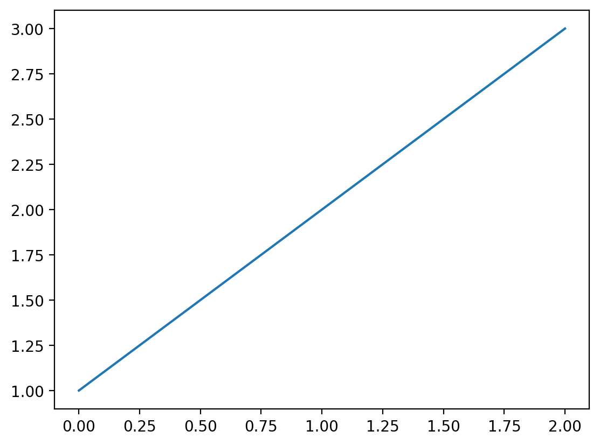

# shell


<!-- WARNING: THIS FILE WAS AUTOGENERATED! DO NOT EDIT! -->

``` python
from fastcore.test import *
from base64 import b64decode
from io import BytesIO
from PIL import Image
```

------------------------------------------------------------------------

<a
href="https://github.com/AnswerDotAI/execnb/blob/main/execnb/shell.py#L50"
target="_blank" style="float:right; font-size:smaller">source</a>

### ExecutionResult.\_\_repr\_\_

``` python

def __repr__(
    
):

```

*Return repr(self).*

------------------------------------------------------------------------

<a
href="https://github.com/AnswerDotAI/execnb/blob/main/execnb/shell.py#L47"
target="_blank" style="float:right; font-size:smaller">source</a>

### ExecutionInfo.\_\_repr\_\_

``` python

def __repr__(
    
):

```

*Return repr(self).*

------------------------------------------------------------------------

<a
href="https://github.com/AnswerDotAI/execnb/blob/main/execnb/shell.py#L53"
target="_blank" style="float:right; font-size:smaller">source</a>

### CaptureShell

``` python

def CaptureShell(
    path:str | Path=None, mpl_format:str='retina', history:bool=False, timeout:Optional[int]=None
):

```

*An enhanced, interactive shell for Python.*

------------------------------------------------------------------------

<a
href="https://github.com/AnswerDotAI/execnb/blob/main/execnb/shell.py#L89"
target="_blank" style="float:right; font-size:smaller">source</a>

### CaptureShell.run_cell

``` python

def run_cell(
    raw_cell, # The code (including IPython code such as %magic functions) to run.
    store_history:bool=False, # If True, the raw and translated cell will be stored in IPython's
history. For user code calling back into IPython's machinery, this
should be set to False.
    silent:bool=False, # If True, avoid side-effects, such as implicit displayhooks and
and logging.  silent=True forces store_history=False.
    shell_futures:bool=True, # If True, the code will share future statements with the interactive
shell. It will both be affected by previous __future__ imports, and
any __future__ imports in the code will affect the shell. If False,
__future__ imports are not shared in either direction.
    cell_id:NoneType=None, # A unique identifier for the cell. This is used in the messaging system
to match output with execution requests and for tracking cell execution
history across kernel restarts. In notebook contexts, this is typically
a UUID generated by the frontend. If None, the kernel may generate an
internal identifier or proceed without cell tracking capabilities.
    stdout:bool=True, stderr:bool=True, display:bool=True, timeout:NoneType=None, verbose:bool=False
):

```

*Run a complete IPython cell.*

``` python
s = CaptureShell(mpl_format='retina')
```

``` python
s.run_cell('a=1');
```

``` python
{ 'display_objects': [],
  'exception': None,
  'quiet': False,
  'result': result: None; err: None; info: <cell: a=1; id: None>,
  'stderr': '',
  'stdout': ''}
```

``` python
o = s.run_cell('print(a)')
o
```

``` python
{ 'display_objects': [],
  'exception': None,
  'quiet': False,
  'result': result: None; err: None; info: <cell: print(a); id: None>,
  'stderr': '',
  'stdout': '1\n'}
```

``` python
o = s.run_cell('from warnings import warn; warn("1")')
o
```

``` python
{ 'display_objects': [],
  'exception': None,
  'quiet': False,
  'result': result: None; err: None; info: <cell: from warnings import warn; warn("1"); id: None>,
  'stderr': '<ipython-input-1-a51443ae013a>:1: UserWarning: 1\n'
            '  from warnings import warn; warn("1")\n',
  'stdout': ''}
```

``` python
o = s.run_cell('1')
o
```

``` python
{ 'display_objects': [],
  'exception': None,
  'quiet': False,
  'result': result: 1; err: None; info: <cell: 1; id: None>,
  'stderr': '',
  'stdout': ''}
```

``` python
o = s.run_cell('from IPython.display import Markdown,display; print(0); display(Markdown("*2*")); Markdown("*1*")')
o
```

``` python
{ 'display_objects': [<IPython.utils.capture.RichOutput object>],
  'exception': None,
  'quiet': False,
  'result': result: <IPython.core.display.Markdown object>; err: None; info: <cell: from IPython.display import Markdown,display; print(0); display(Markdown("*2*")); Markdown("*1*"); id: None>,
  'stderr': '',
  'stdout': '0\n'}
```

``` python
o.result.result
```

*1*

``` python
o.display_objects[0]
```

*2*

``` python
o = s.run_cell('1;')
o
```

``` python
{ 'display_objects': [],
  'exception': None,
  'quiet': True,
  'result': result: 1; err: None; info: <cell: 1;; id: None>,
  'stderr': '',
  'stdout': ''}
```

``` python
o = s.run_cell('import matplotlib.pyplot as plt; plt.plot([1,2,3])')
o
```

``` python
{ 'display_objects': [<IPython.utils.capture.RichOutput object>],
  'exception': None,
  'quiet': False,
  'result': result: [<matplotlib.lines.Line2D object>]; err: None; info: <cell: import matplotlib.pyplot as plt; plt.plot([1,2,3]); id: None>,
  'stderr': '',
  'stdout': ''}
```

``` python
o.result.result[0]
```

``` python
o.display_objects[0]
```



``` python
o = s.run_cell('''
import pandas as pd
pd.DataFrame({'A': [1, 2], 'B': [3, 4]})''')
o
```

``` python
{ 'display_objects': [],
  'exception': None,
  'quiet': False,
  'result': result:    A  B
0  1  3
1  2  4; err: None; info: <cell: 
import pandas as pd
pd.DataFrame({'A': [1, 2], 'B': [3, 4]}); id: None>,
  'stderr': '',
  'stdout': ''}
```

``` python
o.result.result
```

<div>
<style scoped>
    .dataframe tbody tr th:only-of-type {
        vertical-align: middle;
    }
&#10;    .dataframe tbody tr th {
        vertical-align: top;
    }
&#10;    .dataframe thead th {
        text-align: right;
    }
</style>

<table class="dataframe" data-quarto-postprocess="true" data-border="1">
<thead>
<tr style="text-align: right;">
<th data-quarto-table-cell-role="th"></th>
<th data-quarto-table-cell-role="th">A</th>
<th data-quarto-table-cell-role="th">B</th>
</tr>
</thead>
<tbody>
<tr>
<td data-quarto-table-cell-role="th">0</td>
<td>1</td>
<td>3</td>
</tr>
<tr>
<td data-quarto-table-cell-role="th">1</td>
<td>2</td>
<td>4</td>
</tr>
</tbody>
</table>

</div>

``` python
o = s.run_cell('1/0')
o
```

``` python
{ 'display_objects': [],
  'exception': ZeroDivisionError('division by zero'),
  'quiet': False,
  'result': result: None; err: division by zero; info: <cell: 1/0; id: None>,
  'stderr': '',
  'stdout': '\x1b[31m---------------------------------------------------------------------------\x1b[39m\n'
            '\x1b[31mZeroDivisionError\x1b[39m                         '
            'Traceback (most recent call last)\n'
            '\x1b[36mFile '
            '\x1b[39m\x1b[32m<ipython-input-1-9e1622b385b6>:1\x1b[39m\n'
            '\x1b[32m----> \x1b[39m\x1b[32m1\x1b[39m '
            '\x1b[32;43m1\x1b[39;49m\x1b[43m/\x1b[49m\x1b[32;43m0\x1b[39;49m\n'
            '\n'
            '\x1b[31mZeroDivisionError\x1b[39m: division by zero\n'}
```

Testing errors caught after exec:

``` python
o = s.run_cell('import time; time.sleep(2)', timeout=1)
test_eq(type(o['exception']), TimeoutError)
```

Testing errors caught before exec:

``` python
o = s.run_cell('print(', timeout=1)
test_eq(isinstance(o['exception'], SyntaxError), True)
o = s.run_cell("def foo():\npass")
test_eq(isinstance(o['exception'], IndentationError), True)
o = s.run_cell("if True:\n\tpass\n        pass")
test_eq(isinstance(o['exception'], TabError), True)
```

### Cells / run

------------------------------------------------------------------------

<a
href="https://github.com/AnswerDotAI/execnb/blob/main/execnb/shell.py#L102"
target="_blank" style="float:right; font-size:smaller">source</a>

### format_exc

``` python

def format_exc(
    e
):

```

*Format exception `e` as a string list*

------------------------------------------------------------------------

<a
href="https://github.com/AnswerDotAI/execnb/blob/main/execnb/shell.py#L107"
target="_blank" style="float:right; font-size:smaller">source</a>

### NbResult

``` python

def NbResult(
    args:VAR_POSITIONAL, kwargs:VAR_KEYWORD
):

```

*Built-in mutable sequence.*

If no argument is given, the constructor creates a new empty list. The
argument must be an iterable if specified.

------------------------------------------------------------------------

<a
href="https://github.com/AnswerDotAI/execnb/blob/main/execnb/shell.py#L144"
target="_blank" style="float:right; font-size:smaller">source</a>

### CaptureShell.run

``` python

def run(
    code:str, # Python/IPython code to run
    stdout:bool=True, # Capture stdout and save as output?
    stderr:bool=True, # Capture stderr and save as output?
    timeout:Optional[int]=None, # Shell command will time out after {timeout} seconds
    verbose:bool=False, # Show stdout/stderr during execution
):

```

*Run `code`, returning a list of all outputs in Jupyter notebook format*

``` python
s = CaptureShell()
```

``` python
s.run("print(1)")
```

    [{'name': 'stdout', 'output_type': 'stream', 'text': ['1\n']}]

Code can include magics and `!` shell commands:

``` python
o = s.run("%time 1+1")
o
```

    [{'name': 'stdout',
      'output_type': 'stream',
      'text': ['CPU times: user 1 us, sys: 1 us, total: 2 us\n',
       'Wall time: 4.05 us\n']},
     {'data': {'text/plain': ['2']},
      'metadata': {},
      'output_type': 'execute_result',
      'execution_count': None}]

The result of the last successful execution is stored in `result`:

``` python
s.result
```

    2

A trailing `;` stops the result from being captured:

``` python
s.run("1+2;")
```

    []

``` python
o = s.run("1/0")
o
```

    [{'name': 'stdout',
      'output_type': 'stream',
      'text': ['\x1b[31m---------------------------------------------------------------------------\x1b[39m\n',
       '\x1b[31mZeroDivisionError\x1b[39m                         Traceback (most recent call last)\n',
       '\x1b[36mFile \x1b[39m\x1b[32m<ipython-input-1-9e1622b385b6>:1\x1b[39m\n',
       '\x1b[32m----> \x1b[39m\x1b[32m1\x1b[39m \x1b[32;43m1\x1b[39;49m\x1b[43m/\x1b[49m\x1b[32;43m0\x1b[39;49m\n',
       '\n',
       '\x1b[31mZeroDivisionError\x1b[39m: division by zero\n']},
     {'ename': 'ZeroDivisionError',
      'evalue': 'division by zero',
      'output_type': 'error',
      'traceback': ['Traceback (most recent call last):\n',
       '  File "/home/radek/miniconda3/envs/kaggle/lib/python3.11/site-packages/IPython/core/interactiveshell.py", line 3672, in run_code\n    exec(code_obj, self.user_global_ns, self.user_ns)\n',
       '  File "<ipython-input-1-9e1622b385b6>", line 1, in <module>\n    1/0\n    ~^~\n',
       'ZeroDivisionError: division by zero\n']}]

This is how IPython formats exceptions internally:

``` python
from IPython.core.ultratb import VerboseTB
```

``` python
with warnings.catch_warnings():
    warnings.filterwarnings("ignore", category=DeprecationWarning)
    formatter = VerboseTB(color_scheme='Linux')
```

``` python
try: f()
except Exception as e:
    ex = e
    print(formatter.text(type(e), e, e.__traceback__))
```

    ---------------------------------------------------------------------------
    NameError                                 Traceback (most recent call last)
    Cell In[35], line 1
    ----> 1 try: f()
          2 except Exception as e:
          3     ex = e

    NameError: name 'f' is not defined

``` python
s.run("import time; time.sleep(0.1); print('no timeout')", timeout=1)
```

    [{'name': 'stdout', 'output_type': 'stream', 'text': ['no timeout\n']}]

``` python
o = s.run("import time; time.sleep(1.1)", timeout=1)
o[0]['text'][:2]
```

    ['\x1b[31m---------------------------------------------------------------------------\x1b[39m\n',
     '\x1b[31mTimeoutError\x1b[39m                              Traceback (most recent call last)\n']

``` python
o1 = s.run('from IPython.display import Markdown,display; print(0); print(1); display(Markdown("*2*")); Markdown("*1*")')
o1
```

    [{'name': 'stdout', 'output_type': 'stream', 'text': ['0\n', '1\n']},
     {'data': {'text/plain': ['<IPython.core.display.Markdown object>'],
       'text/markdown': ['*2*']},
      'metadata': {},
      'output_type': 'display_data'},
     {'data': {'text/plain': ['<IPython.core.display.Markdown object>'],
       'text/markdown': ['*1*']},
      'metadata': {},
      'output_type': 'execute_result',
      'execution_count': None}]

------------------------------------------------------------------------

<a
href="https://github.com/AnswerDotAI/execnb/blob/main/execnb/shell.py#L158"
target="_blank" style="float:right; font-size:smaller">source</a>

### CaptureShell.run_async

``` python

def run_async(
    code:str, # Python/IPython code to run
    stdout:bool=True, # Capture stdout and save as output?
    stderr:bool=True, # Capture stderr and save as output?
    timeout:Optional[int]=None, # Shell command will time out after {timeout} seconds
    verbose:bool=False, # Show stdout/stderr during execution
):

```

``` python
await s.run_async("1+1")
```

    [{'data': {'text/plain': ['2']},
      'metadata': {},
      'output_type': 'execute_result',
      'execution_count': None}]

------------------------------------------------------------------------

<a
href="https://github.com/AnswerDotAI/execnb/blob/main/execnb/shell.py#L170"
target="_blank" style="float:right; font-size:smaller">source</a>

### render_outputs

``` python

def render_outputs(
    outputs, ansi_renderer:function=_strip, include_imgs:bool=True, pygments:bool=False, md_tfm:function=noop,
    html_tfm:function=noop
):

```

``` python
HTML(render_outputs(o))
```

<pre ><code class=''>---------------------------------------------------------------------------
TimeoutError                              Traceback (most recent call last)
File &lt;ipython-input-1-a5c3817716b6&gt;:1
----&gt; 1 import time; time.sleep(1.1)
&#10;Cell In[6], line 7, in run_cell.&lt;locals&gt;.handler(*args)
----&gt; 7 def handler(*args): raise TimeoutError()
&#10;TimeoutError: 
</code></pre>

We can use `ansi2html` to convert from ANSI to HTML for color rendering.
You need some [css
styles](https://github.com/fastai/fastcore/blob/master/examples/ansi.css)
for the colors to render properly. Jupyter already has these built in so
it’s not neccessary here, but if you plan on using this in another web
app you will need to ensure that css styling is included.

``` python
HTML(render_outputs(o, ansi2html))
```

<pre ><code class='nohighlight hljs'><span class="ansi-red-fg">---------------------------------------------------------------------------</span>
<span class="ansi-red-fg">TimeoutError</span>                              Traceback (most recent call last)
<span class="ansi-cyan-fg">File </span><span class="ansi-green-fg">&lt;ipython-input-1-a5c3817716b6&gt;:1</span>
<span class="ansi-green-fg">----&gt; </span><span class="ansi-green-fg">1</span> <span class="ansi-bold" style="color: rgb(0,135,0)">import</span><span style="color: rgb(188,188,188)"> </span><span class="ansi-blue-intense-fg ansi-bold">time</span>; time.sleep(<span class="ansi-green-fg">1.1</span>)
&#10;<span class="ansi-cyan-fg">Cell</span><span class="ansi-cyan-fg"> </span><span class="ansi-green-fg">In[6]</span><span class="ansi-green-fg">, line 7</span>, in <span class="ansi-cyan-fg">run_cell.&lt;locals&gt;.handler</span><span class="ansi-blue-fg">(*args)</span>
<span class="ansi-green-fg">----&gt; </span><span class="ansi-green-fg">7</span> <span class="ansi-bold" style="color: rgb(0,135,0)">def</span><span style="color: rgb(188,188,188)"> </span><span class="ansi-blue-fg">handler</span>(*args): <span class="ansi-bold" style="color: rgb(0,135,0)">raise</span> <span class="ansi-bold" style="color: rgb(215,95,95)">TimeoutError</span>()
&#10;<span class="ansi-red-fg">TimeoutError</span>: 
</code></pre>

Images and matplotlib figures are captured:

``` python
res = s.run('''import matplotlib.pyplot as plt
plt.figure(figsize=(2,1))
plt.plot([1,2,4]);''')

HTML(render_outputs(res))
```

<img src="data:image/png;base64,iVBORw0KGgoAAAANSUhEUgAAAYMAAAD1CAYAAACyaJl6AAAAOnRFWHRTb2Z0d2FyZQBNYXRwbG90bGliIHZlcnNpb24zLjEwLjAsIGh0dHBzOi8vbWF0cGxvdGxpYi5vcmcvlHJYcgAAAAlwSFlzAAAewgAAHsIBbtB1PgAAHmlJREFUeJzt3Xl01PW9//HXTPaVJGQbsgAhZIFMUIHcCiIBWQyRatjO9WcFenG5t9wrx15ZlApVEYFIabWn2l7qUu+vWoxIhQRwQRI2jYomkwVISICETFaSkH0yM9/7R+IYnC84gZnvd5bX4xzPGf1MMm9tmGff30kmCkEQBBARkUtTyj0AERHJjzEgIiLGgIiIGAMiIgJjQEREYAyIiAiMARERgTEgIiIwBkREBMaAiIjAGBARERgDIiICY0BERGAMiIgIjAEREYExICIiMAZERATGgIiIwBgQEREYAyIigkwxWLduHRQKhemvo0ePyjEGERENcpf6AYuKirBr1y5JHqu3txcajQYAEBYWBnd3yf91iYisSq/Xo6mpCQCgVqvh7e1tlc8r6bOj0WjEo48+Cr1ej/DwcDQ2Ntr08TQaDdLS0mz6GEREciksLMTUqVOt8rkkvUz0yiuv4KuvvkJSUhJWrVol5UMTEdENSLYZ1NTU4NlnnwUAvPbaa5K8ThAWFma6XVhYCJVKZfPHJCKyJa1Wa7riMfQ57lZJFoNf/epX6OzsxIoVK5Ceni5JDIa+RqBSqRAdHW3zxyQikoo1XweV5DLRnj17cODAAYSEhCA7O1uKhyQicgi1rd1yjwBAghi0tbVhzZo1AIDt27dbda0hInJU7d39+PWe73DPznycb+qUexzbXyZat24d6uvrMW3aNKu/aFxbW3vDc61Wa9XHIyKyhk/KGvDMhxo0dfQBANblFGPP43fCTamQbSabxuD48ePYvXs33N3d8frrr0OhsO6/aExMjFU/HxGRLbV26fDc/lLs+67umn/+zcVWvHmiGo/MiJNpMhvGQKfT4bHHHoMgCHjyySehVqtt9VBERHbvUIkWv9lXiubOPrOzAG93hPh5yjDVD2wWg61bt6K8vByxsbHYvHmzTR6jpqbmhudDvwWLiEgOLZ192PxRKQ4Ui1+2npUYhq2L1FCN8JF4smvZJAZnzpzBSy+9BAB49dVX4efnZ4uH4beKEpFdyy3WYtM/S9DSpTM7C/R2x+aFE7HojiirX0K/GTaJwa5du6DT6RAXF4fu7m689957ZvcpKSkx3T5y5Ajq6+sBAAsXLrRZPIiIpNDc2YdN/yxBnqZe9HxOcjhezFIjItA67ytkDTaJQV/fwDWxqqoqPPjggz95/xdeeMF0u7q6mjEgIockCAL2F2ux+Z8laO3uNzsP8vXAbxdOxP23jbKLbWAovo0nEZEVNHb04tl9JThc2iB6Pm9CBLZkpSA8wH62gaFs8kNnb731FgRBuOFfQ19U/vzzz03/fMyYMbYYiYjIJgRBwL5vL2PergLREAT7euCVB2/Hnx+ebLchALgZEBHdtIarvdj4oQaflou/Hf8CdSSevz8Fof5eEk82fIwBEdEwCYKAD05fxvP7S3G1V292PtLPE8/fn4LMVMd5p2TGgIhoGOrbe/H03mJ8frZJ9HzhpFH47cIJGOkA28BQjAERkQUEQcD7X9fihdwydIhsA6H+ntjyQAruTXGcbWAohSAIgtxD2Eptba3p/Ytqamr4Q2pEdFPq2nqwYa8GBefEt4EHbhuFzQsnIliCt5Sw1fMaNwMiousQBAHvfVWDF3PL0dlnvg2EBXhha5YacydEyDCddTEGREQialu7seEDDY5XNoueL7ojCpvum4AgX3nfYM5aGAMioiGMRgH/v/AStuWVo0tnMDuPCPTCS4vUmJ3k+NvAUIwBEdGgmivdWJdTjFNVLaLny6ZEY2PmBIzw8ZB4MttjDIjI5RmNAt754iK2HzqDbpFtQDXCGy8tUiM9MVyG6aTBGBCRS7vY0oW1OcUorL4iev5gWgyeXpCMQG/n2waGYgyIyCUZjQLeOnkBOw6fQW+/0ew8KsgH2xarMWN8mAzTSY8xICKXU9XUiXU5xfj6Yqvo+UP/EounFyTD38t1niJd59+UiFyewSjgzRPVyD58Fn16820gOtgHOxanYlp8qAzTyYsxICKXUNnYiXU5RTh9qU30fPmdo7H+3iT4udA2MJRr/lsTkcswGAXsPlaFnZ+cg05kG4gN8cX2xam4c9xIGaazH4wBETmtioYOPJVTjKKaNrMzhQJYOW0M1s5PhK8nnwr5X4CInI7eYMSfC6rwh08roDOYbwNjQ/2wY0kqpo4JkWE6+8QYEJFTOVvfgbU5RSiubTc7UyiAVdPH4r/nJcLH002G6ewXY0BETqHfYMTrR8/jlSMV6DeYvzN/XJgfspekYvJobgNiGAMicnhldVexNqcIpXVXzc6UCuDRGXF4cm4CvD24DVwPY0BEDkunN+JPRyvxxyOV0BvNt4H4cH9kL0nF7bHBMkznWBgDInJIJZfb8dT7RThT32F2plQA/z5zHJ64Zzy3AQsxBkTkUPr0BvzxSCX+dPQ8DCLbQGJEALKXpiI1Okj64RwYY0BEDqO4tg1r3y/G2QbzbcBNqcCv0sfhP2fHw8ud28BwMQZEZPf69Ab84dMK/LmgSnQbSIoMwMtLJyElaoQM0zkHxoCI7Np3NW1Y+34RKho7zc7clQqsnhWP1bPi4emulGE658EYEJFd6u03YNen5/A/BVUQWQYwQRWI7KWpmDiK24A1MAZEZHe+udiKtTlFqGrqMjvzcFPgidnj8e/p4+Dhxm3AWhgDIrIbPToDdn58Fn89UQ1BZBtQR41A9tJUJEUGSj+ck2MMiMgufHXhCtblFKO62Xwb8HRTYs2c8Xj87ji4cxuwCcaAiGTVrdMj+/BZvHXygug2MCkmCNlLUpEQESD9cC6EMSAi2XxR1YL1HxTjYku32ZmnuxK/npuAR+4ay21AAowBEUmuq0+PHYfO4O1TF0XPb48NQvaSSYgP95d4MtfFGBCRpE5WNmP93mLUXOkxO/NyV2Lt/ET8cvpYuCkVMkznuhgDIpJEZ58e2w6W43+/uCR6PmV0MHYsSUVcGLcBOTAGRGRzxyuasf6DYlxuM98GvD2UWDc/CSumjeE2ICPGgIhspqO3H1vzyvFuYY3oedrYEOxYnIoxoX4ST0Y/xhgQkU3kn2vC0x8Uo6691+zMx8MNGzKS8PDPRkPJbcAuMAZEZFXtPf14MbcMe76uFT2/M24kti9ORexIX4knoxthDIjIao6cacAze0tQf9V8G/DzdMPTC5Lx/9JiuQ3YIcaAiG5Ze3c/nj9Qhg9Oi28Dd8WH4qVFasSEcBuwV4wBEd2ST8oasPFDDRo7+szO/L3csTEzGf86NQYKBbcBe8YYENFNae3S4bn9pdj3XZ3o+d0JYXhpkRpRQT4ST0Y3gzEgomE7VFKP3+wrQXOn+TYQ4OWOZ++bgKVTorkNOBDGgIgsdqVLh80flWJ/kfg2MCsxDFsXqaEawW3A0TAGRGSRPI0Wz+4rQUuXzuws0NsdmxdOxKI7orgNOCjGgIhuqLmzD5v/WYpcjVb0fE5yOF7MUiMi0FviyciaGAMiEiUIAg4Ua7H5o1JcEdkGRvh44LmfT8T9t43iNuAEGAMiMtPU0Ydn95XgUGm96Pm8CRHYkpWC8ABuA86CMSAiE0EQ8FFRHTZ/VIq27n6z82BfDzx3fwoWpqq4DTgZxoCIAACNV3vxzIcl+LS8QfR8gToSz/08BWEBXhJPRlJgDIhcnCAI+PDby/jtR6W42qs3Ox/p54nn709BZqpKhulIKowBkQurb+/FMx9qcORMo+j5fakqPPfziRjpz23A2TEGRC5IEAS8/00tXjhQhg6RbSDU3xNbHkjBvSncBlwFY0DkYuraevD0Xg3yzzWJnt9/2yj8duFEBPt5SjwZyYkxIHIRgiDgH1/VYEtuOTr7zLeBsAAvvPhACuZNjJRhOpIbY0DkAmpbu/H0Xg2OVTSLni+6Iwqb7puAIF9uA66KMSByYoIg4O+Fl7A1txxdOoPZeUSgF15apMbspAgZpiN7whgQOamaK91Y/0ExTp5vET1fOjkav7lvAkb4eEg8GdkjxoDIyRiNAv73y4vYdvAMukW2AdUIb2xdpMasxHAZpiN7xRgQOZGLLV1Yl1OML6uviJ7/69QYPJOZjEBvbgN0LcaAyAkYjQLePnUBOw6dRU+/+TYQFeSDlxapcXdCmAzTkSNgDIgcXHVzF9blFOGrC62i5w/9Syw2ZCQhgNsA3QBjQOSgDEYBb56oRvbhs+jTG83Oo4N9sH1xKqbHh8owHTkaxoDIAZ1v6sTa94tw+lKb6PnyO0dj/b1J8PPiH3GyDL9SiByIwShg97Eq7PzkHHQi20BsiC+2L07FneNGyjAdOTLGgMhBVDR0YG1OMb6raRM9XzltDNbdmwhfT/6xpuHjVw2RndMbjPjLsSr8/pMK6Azm28CYkb7YsWQS0saGyDAdOQvGgMiOna3vwNqcIhTXtpudKRTAv00fi6fmJcLH002G6ciZMAZEdqjfYMSf88/jD59VoN8gmJ3Hhfohe2kqJo/mNkDWwRgQ2Zly7VU89X4RSuuump0pFcCjM+Lw5NwEeHtwGyDrYQyI7IROb8Sfjlbij0cqoTeabwPx4f7IXpKK22ODZZiOnB1jQGQHSi63Y21OMcq14tvA4zPHYc0947kNkM0wBkQy0umN+OORCvzp6HnRbSAhwh/ZSyZhUkyQ9MORS2EMiGSiqW3H2pwinKnvMDtzUyrwHzPH4b/uiYeXO7cBsj2bxuD06dM4dOgQjh07hpKSEjQ2NsLDwwOjRo3CtGnTsGrVKsyYMcOWIxDZnT69Aa98VoHX86tgENkGkiIDkL1kEtTRI2SYjlyVzWIwc+ZMFBQUmP1znU6HiooKVFRU4O2338bDDz+M3bt3w9OTv3uVnN93NW1Y+34RKho7zc7clQqsnhWP1bPi4emulGE6cmU2i8Hly5cBAKNGjcLSpUsxY8YMxMbGwmAw4NSpU9i5cycuX76Md955B3q9Hn//+99tNQqR7Hr7Ddj16Tn8T0EVRJYBTFAFIntpKiaO4jZA8lAIgiDypXnr7rvvPixfvhyLFy+Gm5v5Nc/m5mZMnz4d586dAwAUFBRY/ZJRbW0tYmJiAAA1NTWIjo626ucnssQ3F1uxLqcI55u6zM483BT4r9nj8R/p4+Dhxm2AfpqtntdsthkcOHDghuehoaHYuXMnFi5cCADIycnh6wfkVHr7Ddj58VnsPl4Nsf/LlRIViJeXTkJSZKD0wxH9iKzfTZSenm66ff78efkGIbKyry9cwbqcYlQ1m28Dnm5KrJkzHo/dHcdtgOyGrDHQ6XSm20ol/1CQ4+vRGZB9+CzePCm+DUyKHoHspZOQEBEg/XBENyBrDPLz8023k5KSZJyE6NZ9WdWCdR8U42JLt9mZp7sSv56bgEfuGgt3bgNkh2SLgdFoxLZt20x/v2zZsmF/jtra2huea7XaYX9OouGoudKNPI0WeRotikTeZhoAbo8NQvaSVMSHcxsg+yVbDHbt2oXCwkIAQFZWFqZMmTLsz/H9K+pEUrrU0o28koEAiP2ege95uSvx1LxE/NtdY+GmVEg4IdHwyRKD/Px8bNiwAQAQHh6O1157TY4xiCx2saULuYMbQMll8zeT+7Epo4OxY0kq4sL8JZiO6NZJHoPS0lJkZWVBr9fDy8sLe/bsQURExE19rpqamhuea7VapKWl3dTnJqpu7kKeRovcYi3KRN5NVEyInyf+c1Y8Vkwbw22AHIqkMaiursa8efPQ2toKNzc3vPvuu5g5c+ZNfz7+EBlZ2/mmThzUaJGrqRd9O2kxwb4euDclEgvUKvwsbiS/XZQckmQxqKurw5w5c1BXVweFQoE33ngDWVlZUj080XVVNnaaXgQWewdRMSF+npg/MRKZahV+FhfC7xAihydJDJqbmzF37lxUVVUBAF599VUsX75ciocmElXR0GF6DeBcg/mbxokJ9f8hAGljGQByLjaPQXt7O+bPn4+ysjIAwLZt27B69WpbPyzRNQRBwLmGHzYAsXcNFRPq74WMwUtAaWND+DoAOS2bxqC7uxuZmZk4ffo0AGDjxo1Yv369LR+SyEQQBJxt6EBesRa5Gq3oG8WJCQv4IQBTxzAA5BpsFgOdToesrCycOHECALBmzRps2bLFVg9HBGAgAOXajoENoESLKgsDEBHohYwUFRaoVZg8OpgBIJdjsxg8+OCD+PjjjwEAs2fPxqpVq1BSUnLd+3t6eiIhIcFW45ATEwQBpXVXcbBEizxNPapF3hxOTGSgNzLUAxvA5NhgKBkAcmE2i8HevXtNt48cOYLU1NQb3n/06NG4cOGCrcYhJ/N9AHI1WhzUaHFB5P2AxKhGeCMjRYXM1EjcHsMAEH1P1jeqIxoOQRCgudw+GIB6XLpiWQCignwGXgNIVeG26CAGgEiEzWJgo1+gRi5GEAQU1bbj4OBrADVXeiz6uKggH2SmqpCREonbYoKgUDAARDfCzYDsjiAI+K6mbfDbQOtxuc2yAEQH+yBTPfAicGr0CAaAaBgYA7ILRqOAbwcDcFCjRV17r0UfFxviiwVqFTLVKqREBTIARDeJMSDZGI0CTl9qRZ6mHgdLtNBaGIAxIwcCsECtwsRRDACRNTAGJCmjUcA3l1qRW6zFoZJ61F+1LABjQ/2wYPDbQCeoGAAia2MMyOYMRgFfX7gycAmopB6NHX0WfVxcmJ/pNYCkyAAGgMiGGAOyCYNRwFdDAtBkYQDiw/0HLwFFIjGCASCSCmNAVmMwCviyugV5Gi0OlTSgudOyAIwfDEBmqgoJEfw9wURyYAzolugNRnxZfQW5Gi0+Lq1Hc6fOoo9LjAgwbQDjGQAi2TEGNGx6gxFfVP0QgJYuywKQFBmATLUKGWoV4sP5u4GJ7AljQBbpNxhx6vzAJaDDpfVo7e636OOSVYHIHPwuIP5yeCL7xRjQdfUbjDhR2Yw8jRYflzWgzcIATBwVaPo5gLGhfjaekoisgTGga+j0Rpw434y84oEAtPdYFgB11AgsUA+8F9AYBoDI4TAGBJ3eiOOVTcgtrscnZfW42qu36ONSowcCsCBFhdiRvjaekohsiTFwUX16A46dG7gE9El5AzosDMCkmCBkqiORkaJCTAgDQOQsGAMX0ttvwLGKgQB8WtaAjj7LAnB7bBAy1SrcmxKJ6GAGgMgZMQZOrrffgPxzTcjTaPFZeSM6LQzAHbFBA68BqFWICvKx8ZREJDfGwAn19htw9Gwj8jT1+Ky8AV06g0UfN2V08GAAIqEawQAQuRLGwEn06AYCkKvR4siZRnRbEACFApg6OgQZg68BRI7wlmBSIrJHjIED69bp8fmZgUtAR840oqffwgCMCTG9BhARyAAQEWPgcLr69DhyphEHSwYC0Ntv/MmPUSqAtLEDAZifEonwAAaAiK7FGDiAzsEA5BVrcfSc5QH4WdxIZKhVuHdiJMICvCSYlIgcFWNgpzr79PisvAG5xVrkn2tCn96yANw5biQWqFWYPzESof4MABFZhjGwIx29/fi0vAF5mnrkn2uCzoIAuCkVmDYYgHkTIjCSASCim8AYyKy9px+flTcgT6NFwblm6Aw/HQB3pQLT4kOxICUS8yZGIsTPU4JJiciZMQYyaO/pxydlAwE4VtGEfoPwkx/jrlRgenwoMtUqzJ0QgWAGgIisiDGQSHt3Pw6X1eOgRovjlc0WBcDDTYG74kMHLwFFYoSvhwSTEpErYgxsqK1bh49LG5Cr0eJEZTP0xp8OgKebEjPGhyJDrcLc5AgGgIgkwRhY2ZUuHT4urUeuRotT51ssDsDdCQMbwJwJEQj0ZgCISFqMgRW0dPbhcGkDDpZocfJ8CwyWBMBdiZkJYchUqzA7OZwBICJZMQY3qbmzD4dL65Gn0eKLqisWBcDLXYn0xDAsUKswOykcAQwAEdkJxmAYmjr6cKi0HnnFWnxZ3QILnv/h7aHErMRwZAwGwN+L/8mJyP7wmeknNHb04lDJwAZQWH3F4gDMTgrHArUKsxLD4ccAEJGd47OUiMarvThYMvAi8FcXrkCwIAA+Hm6YnRyOTLUK6Ylh8PXkf1oichx8xvqRT8oa8Ng7X1sUAF9PN9yTHIEFKZFITwyHj6eb7QckIrIBxuBHJo8OhlKhgOE6NfD7PgCDG4C3BwNARI6PMfiRED9PTBs3Escqmk3/zN/LHXOSB14DuDuBASAi58MYiFigVuG7S22YOyECGWoVZowPZQCIyKkxBiKybo/Cojui4OXOABCRa2AMRHALICJXo5R7ACIikp9TbwZ6vd50W6vVyjgJEZF1DH0uG/ocd6ucOgZNTU2m22lpaTJOQkRkfU1NTRgzZoxVPhcvExERERSCYMnP2jqm3t5eaDQaAEBYWBjc3S1bhLRarWmTKCwshEqlstmM5Bz4NUPDdbNfM3q93nTVQ61Ww9vb2yrzOPVlIm9vb0ydOvWWPodKpUJ0dLSVJiJXwK8ZGq7hfs1Y69LQULxMREREjAERETEGREQExoCIiMAYEBERGAMiIgJjQEREcPIfOiMiIstwMyAiIsaAiIgYAyIiAmNARERgDIiICIwBERGBMSAiIjAGREQExoCIiMAYmLl06RKeeuopJCcnw8/PDyEhIUhLS8PLL7+M7u5uuccjO9HY2IgDBw5g06ZNyMjIQGhoKBQKBRQKBVauXCn3eGSHTp8+ja1btyIjIwMxMTHw8vKCv78/EhISsHLlShw7dkzW+fh2FEPk5ubioYceQnt7u+h5YmIi8vLyEBcXJ/FkZG8UCsV1z1asWIG33npLumHI7s2cORMFBQU/eb+HH34Yu3fvhqenpwRTXYubwaCioiIsW7YM7e3t8Pf3x4svvoiTJ0/is88+w6OPPgoAOHv2LDIzM9HZ2SnztGRPYmJiMG/ePLnHIDt2+fJlAMCoUaOwZs0a5OTkoLCwEKdOncLvfvc7REVFAQDeeecd+TZLgQRBEIT09HQBgODu7i6cPHnS7HzHjh0CAAGA8Nxzz8kwIdmTTZs2Cfv37xfq6+sFQRCE6upq09fHihUr5B2O7E5mZqbwj3/8Q9Dr9aLnTU1NQkJCgulrqKCgQOIJBYExEAShsLDQ9D/C448/Lnofg8EgJCcnCwCE4OBgQafTSTwl2TPGgG7V/v37TV9DTzzxhOSPz8tEAPbt22e6/ctf/lL0PkqlEsuXLwcAtLa24ujRoxJMRkSuIj093XT7/Pnzkj8+YwCYXsX38/PD5MmTr3u/mTNnmm4fP37c5nMRkevQ6XSm20ql9E/NjAGA8vJyAEB8fDzc3d2ve7+kpCSzjyEisob8/HzT7aHPNVJx+Rj09vaiubkZABAdHX3D+wYHB8PPzw8AUFNTY/PZiMg1GI1GbNu2zfT3y5Ytk3wGl49BR0eH6ba/v/9P3v/7GPDbS4nIWnbt2oXCwkIAQFZWFqZMmSL5DC4fg97eXtNtS37Qw8vLCwDQ09Njs5mIyHXk5+djw4YNAIDw8HC89tprsszh8jHw9vY23R76As719PX1AQB8fHxsNhMRuYbS0lJkZWVBr9fDy8sLe/bsQUREhCyzuHwMAgICTLctufTT1dUFwLJLSkRE11NdXY158+ahtbUVbm5uePfdd6/5jkWpuXwMvL29ERoaCgCora294X1bW1tNMYiJibH5bETknOrq6jBnzhzU1dVBoVDgjTfeQFZWlqwzuXwMACA5ORkAUFlZCb1ef937nTlzxuxjiIiGo7m5GXPnzkVVVRUA4NVXXzX9QKucGAMAd911F4CBS0DffPPNde839PuAp0+fbvO5iMi5tLe3Y/78+SgrKwMAbNu2DatXr5Z5qgGMAYAHHnjAdPvNN98UvY/RaMTf/vY3AEBQUBBmzZolxWhE5CS6u7uRmZmJ06dPAwA2btyI9evXyzzVDxgDAGlpaZgxYwYA4K9//StOnTpldp+dO3eafup4zZo18PDwkHRGInJcOp0OWVlZOHHiBICB55AtW7bIPNW1+MttBn377beYPn06enp64O/vj2eeeQazZs1CT08P3nvvPfzlL38BACQkJODrr7++5ruQyPUcP34clZWVpr9vbm7G2rVrAQxcQnzkkUeuuT9/+5lrW7x4Mfbu3QsAmD17Nn7/+9/f8BckeXp6IiEhQarxADAG19i/fz9+8Ytf4OrVq6LnCQkJyM3NRXx8vMSTkb1ZuXIl3n77bYvvzz9mru1GT/xiRo8ejQsXLthmmOvgZaIhFi5ciOLiYjz55JNISEiAr68vgoKCMGXKFGzfvh3ffvstQ0BETombARERcTMgIiLGgIiIwBgQEREYAyIiAmNARERgDIiICIwBERGBMSAiIjAGREQExoCIiMAYEBERGAMiIgJjQEREYAyIiAiMARERgTEgIiIwBkREBMaAiIjAGBARERgDIiICY0BERGAMiIgIjAEREYExICIiMAZERATg/wB0jnv6vy3OYQAAAABJRU5ErkJggg=="/>

If an exception is raised then the exception type, object, and
stacktrace are stored in `exc`:

``` python
o = s.run('raise Exception("Oops")')
o
```

    [{'name': 'stdout',
      'output_type': 'stream',
      'text': ['\x1b[31m---------------------------------------------------------------------------\x1b[39m\n',
       '\x1b[31mException\x1b[39m                                 Traceback (most recent call last)\n',
       '\x1b[36mFile \x1b[39m\x1b[32m<ipython-input-1-01648acb07bd>:1\x1b[39m\n',
       '\x1b[32m----> \x1b[39m\x1b[32m1\x1b[39m \x1b[38;5;28;01mraise\x1b[39;00m \x1b[38;5;167;01mException\x1b[39;00m(\x1b[33m"\x1b[39m\x1b[33mOops\x1b[39m\x1b[33m"\x1b[39m)\n',
       '\n',
       '\x1b[31mException\x1b[39m: Oops\n']},
     {'ename': 'Exception',
      'evalue': 'Oops',
      'output_type': 'error',
      'traceback': ['Traceback (most recent call last):\n',
       '  File "/home/radek/miniconda3/envs/kaggle/lib/python3.11/site-packages/IPython/core/interactiveshell.py", line 3672, in run_code\n    exec(code_obj, self.user_global_ns, self.user_ns)\n',
       '  File "<ipython-input-1-01648acb07bd>", line 1, in <module>\n    raise Exception("Oops")\n',
       'Exception: Oops\n']}]

``` python
s.exc
```

    Exception('Oops')

------------------------------------------------------------------------

<a
href="https://github.com/AnswerDotAI/execnb/blob/main/execnb/shell.py#L203"
target="_blank" style="float:right; font-size:smaller">source</a>

### CaptureShell.cell

``` python

def cell(
    cell, stdout:bool=True, stderr:bool=True, verbose:bool=False
):

```

*Run `cell`, skipping if not code, and store outputs back in cell*

``` python
clean = Path('../tests/clean.ipynb')
nb = read_nb(clean)
c = nb.cells[1]
c
```

``` json
{ 'cell_type': 'code',
  'execution_count': None,
  'id': 'b123d6d0',
  'idx_': 1,
  'metadata': {},
  'outputs': [],
  'source': 'print(1)\n2'}
```

``` python
s.cell(c)
c.outputs
```

    [{'name': 'stdout', 'output_type': 'stream', 'text': ['1\n']},
     {'data': {'text/plain': ['2']},
      'metadata': {},
      'output_type': 'execute_result',
      'execution_count': None}]

------------------------------------------------------------------------

<a
href="https://github.com/AnswerDotAI/execnb/blob/main/execnb/shell.py#L211"
target="_blank" style="float:right; font-size:smaller">source</a>

### find_output

``` python

def find_output(
    outp, # Output from `run`
    ot:str='execute_result', # Output_type to find
):

```

*Find first output of type `ot` in
[`CaptureShell.run`](https://AnswerDotAI.github.io/execnb/shell.html#captureshell.run)
output*

``` python
find_output(c.outputs)['data']
```

``` json
{'text/plain': ['2']}
```

``` python
find_output(c.outputs, 'stream')['text']
```

    ['1\n']

------------------------------------------------------------------------

<a
href="https://github.com/AnswerDotAI/execnb/blob/main/execnb/shell.py#L218"
target="_blank" style="float:right; font-size:smaller">source</a>

### out_exec

``` python

def out_exec(
    outp
):

```

*Get data from execution result in `outp`.*

``` python
out_exec(c.outputs)
```

    '2'

------------------------------------------------------------------------

<a
href="https://github.com/AnswerDotAI/execnb/blob/main/execnb/shell.py#L224"
target="_blank" style="float:right; font-size:smaller">source</a>

### out_stream

``` python

def out_stream(
    outp
):

```

*Get text from stream in `outp`.*

``` python
out_stream(c.outputs)
```

    '1'

------------------------------------------------------------------------

<a
href="https://github.com/AnswerDotAI/execnb/blob/main/execnb/shell.py#L230"
target="_blank" style="float:right; font-size:smaller">source</a>

### out_error

``` python

def out_error(
    outp
):

```

*Get traceback from error in `outp`.*

------------------------------------------------------------------------

<a
href="https://github.com/AnswerDotAI/execnb/blob/main/execnb/shell.py#L239"
target="_blank" style="float:right; font-size:smaller">source</a>

### CaptureShell.run_all

``` python

def run_all(
    nb, # A notebook read with `nbclient` or [`read_nb`](https://AnswerDotAI.github.io/execnb/nbio.html#read_nb)
    exc_stop:bool=False, # Stop on exceptions?
    preproc:callable=_false, # Called before each cell is executed
    postproc:callable=_false, # Called after each cell is executed
    inject_code:str | None=None, # Code to inject into a cell
    inject_idx:int=0, # Cell to replace with `inject_code`
    verbose:bool=False, # Show stdout/stderr during execution
):

```

*Run all cells in `nb`, stopping at first exception if `exc_stop`*

``` python
nb.cells[2].outputs
```

    []

``` python
s.run_all(nb)
nb.cells[2].outputs
```

    [{'data': {'text/plain': ['<IPython.core.display.Markdown object>'],
       'text/markdown': ["This is *bold*. Here's a [link](https://www.fast.ai)."]},
      'metadata': {},
      'output_type': 'execute_result',
      'execution_count': None}]

With `exc_stop=False` (the default), execution continues after
exceptions, and exception details are stored into the appropriate cell’s
output:

``` python
nb.cells[-1].source
```

    'raise Exception("Oopsie!")'

``` python
nb.cells[-1].outputs
```

    [{'name': 'stdout',
      'output_type': 'stream',
      'text': ['\x1b[31m---------------------------------------------------------------------------\x1b[39m\n',
       '\x1b[31mException\x1b[39m                                 Traceback (most recent call last)\n',
       '\x1b[36mFile \x1b[39m\x1b[32m<ipython-input-1-1c97c1d317ab>:1\x1b[39m\n',
       '\x1b[32m----> \x1b[39m\x1b[32m1\x1b[39m \x1b[38;5;28;01mraise\x1b[39;00m \x1b[38;5;167;01mException\x1b[39;00m(\x1b[33m"\x1b[39m\x1b[33mOopsie!\x1b[39m\x1b[33m"\x1b[39m)\n',
       '\n',
       '\x1b[31mException\x1b[39m: Oopsie!\n']},
     {'ename': 'Exception',
      'evalue': 'Oopsie!',
      'output_type': 'error',
      'traceback': ['Traceback (most recent call last):\n',
       '  File "/home/radek/miniconda3/envs/kaggle/lib/python3.11/site-packages/IPython/core/interactiveshell.py", line 3672, in run_code\n    exec(code_obj, self.user_global_ns, self.user_ns)\n',
       '  File "<ipython-input-1-1c97c1d317ab>", line 1, in <module>\n    raise Exception("Oopsie!")\n',
       'Exception: Oopsie!\n']}]

With `exc_stop=True`, exceptions in a cell are raised and no further
processing occurs:

``` python
try: s.run_all(nb, exc_stop=True)
except Exception as e: print(f"got exception: {e}")
```

    got exception: Oopsie!

We can pass a function to `preproc` to have it run on every cell. It can
modify the cell as needed. If the function returns `True`, then that
cell will not be executed. For instance, to skip the cell which raises
an exception:

``` python
nb = read_nb(clean)
s.run_all(nb, preproc=lambda c: 'raise' in c.source)
```

This cell will contain no output, since it was skipped.

``` python
nb.cells[-1].outputs
```

    []

``` python
nb.cells[1].outputs
```

    [{'name': 'stdout', 'output_type': 'stream', 'text': ['1\n']},
     {'data': {'text/plain': ['2']},
      'metadata': {},
      'output_type': 'execute_result',
      'execution_count': None}]

You can also pass a function to `postproc` to modify a cell after it is
executed.

------------------------------------------------------------------------

<a
href="https://github.com/AnswerDotAI/execnb/blob/main/execnb/shell.py#L258"
target="_blank" style="float:right; font-size:smaller">source</a>

### CaptureShell.execute

``` python

def execute(
    src:str | Path, # Notebook path to read from
    dest:str | None=None, # Notebook path to write to
    exc_stop:bool=False, # Stop on exceptions?
    preproc:callable=_false, # Called before each cell is executed
    postproc:callable=_false, # Called after each cell is executed
    inject_code:str | None=None, # Code to inject into a cell
    inject_path:str | Path | None=None, # Path to file containing code to inject into a cell
    inject_idx:int=0, # Cell to replace with `inject_code`
    verbose:bool=False, # Show stdout/stderr during execution
):

```

*Execute notebook from `src` and save with outputs to \`dest*

This is a shortcut for the combination of
[`read_nb`](https://AnswerDotAI.github.io/execnb/nbio.html#read_nb),
[`CaptureShell.run_all`](https://AnswerDotAI.github.io/execnb/shell.html#captureshell.run_all),
and
[`write_nb`](https://AnswerDotAI.github.io/execnb/nbio.html#write_nb).

``` python
s = CaptureShell()
try:
    s.execute(clean, 'tmp.ipynb')
    print(read_nb('tmp.ipynb').cells[1].outputs)
finally: Path('tmp.ipynb').unlink()
```

    [{'name': 'stdout', 'output_type': 'stream', 'text': ['1\n']}, {'data': {'text/plain': ['2']}, 'execution_count': None, 'metadata': {}, 'output_type': 'execute_result'}]

``` python
p = Path.home()/'git'/'fastcore'/'nbs'
n = p/'03a_parallel.ipynb'
```

------------------------------------------------------------------------

<a
href="https://github.com/AnswerDotAI/execnb/blob/main/execnb/shell.py#L280"
target="_blank" style="float:right; font-size:smaller">source</a>

### CaptureShell.prettytb

``` python

def prettytb(
    fname:str | Path=None, # filename to print alongside the traceback
):

```

*Show a pretty traceback for notebooks, optionally printing `fname`.*

If an error occurs while running a notebook, you can retrieve a pretty
version of the error with the `prettytb` method:

``` python
s = CaptureShell()
try:
    s.execute('../tests/error.ipynb', exc_stop=True)
except:
    print(s.prettytb())
```

    AssertionError in ../tests/error.ipynb:
    ===========================================================================

    While Executing Cell #2:
    Traceback (most recent call last):
      File "/tmp/ipykernel_1087357/1421292703.py", line 3, in <module>
        s.execute('../tests/error.ipynb', exc_stop=True)
      File "/tmp/ipykernel_1087357/3276016238.py", line 19, in execute
        self.run_all(nb, exc_stop=exc_stop, preproc=preproc, postproc=postproc,
      File "/tmp/ipykernel_1087357/3244179380.py", line 20, in run_all
        if self.exc and exc_stop: raise self.exc from None
                                  ^^^^^^^^^^^^^^^^^^^^^^^^
      File "/home/radek/miniconda3/envs/kaggle/lib/python3.11/site-packages/IPython/core/interactiveshell.py", line 3672, in run_code
        exec(code_obj, self.user_global_ns, self.user_ns)
      File "<ipython-input-1-b968a57a586e>", line 3, in <module>
        foo()
      File "/home/radek/workspace/execnb/tests/err.py", line 2, in foo
        assert 13 == 98
               ^^^^^^^^
    AssertionError

If you pass `inject_code` to
[`CaptureShell.execute`](https://AnswerDotAI.github.io/execnb/shell.html#captureshell.execute)
or
[`CaptureShell.run_all`](https://AnswerDotAI.github.io/execnb/shell.html#captureshell.run_all),
the source of `nb.cells[inject_idx]` will be replaced with
`inject_code`. By default, the first cell is replaced. For instance
consider this notebook:

``` python
nb = read_nb('../tests/params.ipynb')
for c in nb.cells: print('- ',c.source)
```

    -  a=1
    -  print(a)

We can replace the first cell with `a=2` by passing that as
`inject_code`, and the notebook will run with that change:

``` python
nb = read_nb('../tests/params.ipynb')
s.run_all(nb, inject_code="a=2")
list(nb.cells)
```

    [{'cell_type': 'code',
      'execution_count': None,
      'id': 'a63ce885',
      'metadata': {},
      'outputs': [],
      'source': 'a=2',
      'idx_': 0},
     {'cell_type': 'code',
      'execution_count': None,
      'id': 'ea528db5',
      'metadata': {},
      'outputs': [{'name': 'stdout', 'output_type': 'stream', 'text': ['2\n']}],
      'source': 'print(a)',
      'idx_': 1}]

This can be used with
[`CaptureShell.execute`](https://AnswerDotAI.github.io/execnb/shell.html#captureshell.execute)
to parameterise runs of models in notebooks. Place any defaults for
configuration code needed in the first cell, and then when running
`execute` pass in new parameters as needed in `inject_code`. To replace
only some of the defaults, leave an empty cell as the second cell, and
inject code using `inject_idx=1` to replace the empty second cell with
code that overrides some of the defaults set in the first cell. When
using `execute` you can pass `inject_path` instead of `inject_code` to
read the injected code from a file.

------------------------------------------------------------------------

<a
href="https://github.com/AnswerDotAI/execnb/blob/main/execnb/shell.py#L292"
target="_blank" style="float:right; font-size:smaller">source</a>

### exec_nb

``` python

def exec_nb(
    src:str, # Notebook path to read from
    dest:str='', # Notebook path to write to
    exc_stop:bool=False, # Stop on exceptions?
    inject_code:str=None, # Code to inject into a cell
    inject_path:str=None, # Path to file containing code to inject into a cell
    inject_idx:int=0, # Cell to replace with `inject_code`
    verbose:bool=False, # Show stdout/stderr during execution
):

```

*Execute notebook from `src` and save with outputs to `dest`*

This is the command-line version of
[`CaptureShell.execute`](https://AnswerDotAI.github.io/execnb/shell.html#captureshell.execute).
Run `exec_nb -h` from the command line to see how to pass arguments. If
you don’t pass `dest` then the output notebook won’t be saved; this is
mainly useful for running tests.

------------------------------------------------------------------------

<a
href="https://github.com/AnswerDotAI/execnb/blob/main/execnb/shell.py#L306"
target="_blank" style="float:right; font-size:smaller">source</a>

### SmartCompleter

``` python

def SmartCompleter(
    shell, # a pointer to the ipython shell itself.  This is needed
because this completer knows about magic functions, and those can
only be accessed via the ipython instance.
    namespace:NoneType=None, # an optional dict where completions are performed.
    jedi:bool=False
):

```

*Extension of the completer class with IPython-specific features*

``` python
cc = SmartCompleter(get_ipython())

def test_set(a,b): return test_eq(set(a), set(b))

class _f:
    def __init__(self): self.bar,self.baz,self.room = 0,0,0

foo = _f()

assert set(cc("b")).issuperset(['bool', 'bytes'])
test_set(cc("foo.b"), ['bar', 'baz'])
test_set(cc("x=1; x = foo.b"), ['bar', 'baz'])
test_set(cc("ab"), ['abs'])
test_set(cc("b = ab"), ['abs'])
test_set(cc(""), [])
test_set(cc("foo."), ['bar', 'baz', 'room'])
test_set(cc("nonexistent.b"), [])
test_set(cc("foo.nonexistent.b"), [])
assert set(cc("import ab")).issuperset(['abc'])
test_set(cc("from abc import AB"), ['ABC', 'ABCMeta'])
```

``` python
s = CaptureShell()
cc = SmartCompleter(s)
s.run('''def captures(pat, s, n, **kw):
    return 1''')
cc('captures(')
```

    ['n=', 'pat=', 's=']

------------------------------------------------------------------------

<a
href="https://github.com/AnswerDotAI/execnb/blob/main/execnb/shell.py#L327"
target="_blank" style="float:right; font-size:smaller">source</a>

### CaptureShell.complete

``` python

def complete(
    c
): # The actual text that was completed.

```

*Return the completed text and a list of completions.*

``` python
s = CaptureShell()
s.run('a=1')
s.complete('a.b')
```

    ['bit_count', 'bit_length']

``` python
s.run('import re')
s.complete('re.compile(')
```

    ['flags=', 'pattern=']
