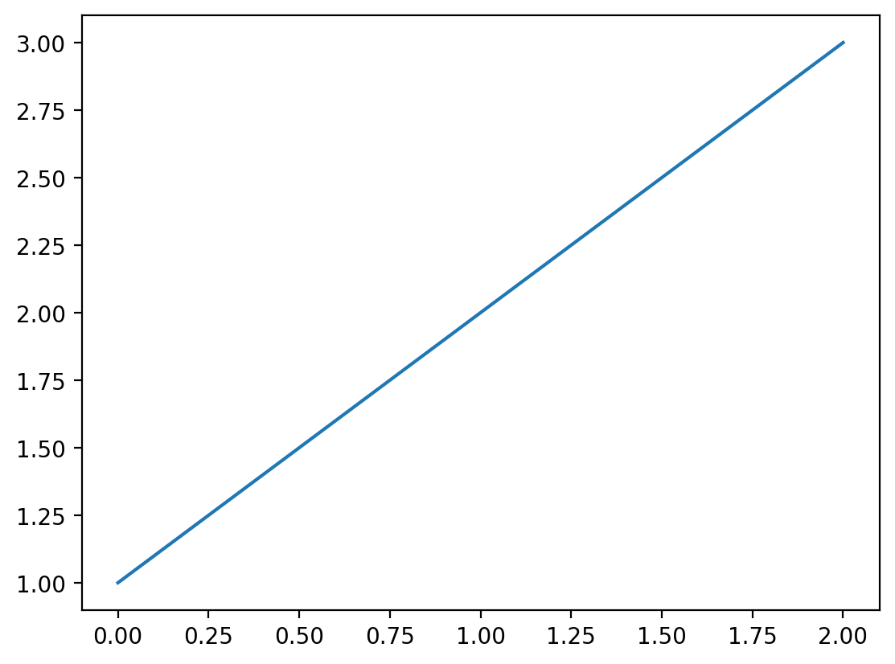

# shell


<!-- WARNING: THIS FILE WAS AUTOGENERATED! DO NOT EDIT! -->

``` python
from fastcore.test import *
from base64 import b64decode
from io import BytesIO
from PIL import Image
```

------------------------------------------------------------------------

<a
href="https://github.com/AnswerDotAI/execnb/blob/main/execnb/shell.py#L50"
target="_blank" style="float:right; font-size:smaller">source</a>

### ExecutionResult.\_\_repr\_\_

>  ExecutionResult.__repr__ ()

*Return repr(self).*

------------------------------------------------------------------------

<a
href="https://github.com/AnswerDotAI/execnb/blob/main/execnb/shell.py#L47"
target="_blank" style="float:right; font-size:smaller">source</a>

### ExecutionInfo.\_\_repr\_\_

>  ExecutionInfo.__repr__ ()

*Return repr(self).*

------------------------------------------------------------------------

<a
href="https://github.com/AnswerDotAI/execnb/blob/main/execnb/shell.py#L53"
target="_blank" style="float:right; font-size:smaller">source</a>

### CaptureShell

>  CaptureShell (path:str|pathlib.Path=None, mpl_format='retina',
>                    history=False, timeout:Optional[int]=None)

*An enhanced, interactive shell for Python.*

------------------------------------------------------------------------

<a
href="https://github.com/AnswerDotAI/execnb/blob/main/execnb/shell.py#L88"
target="_blank" style="float:right; font-size:smaller">source</a>

### CaptureShell.run_cell

>  CaptureShell.run_cell (raw_cell, store_history=False, silent=False,
>                             shell_futures=True, cell_id=None, stdout=True,
>                             stderr=True, display=True, timeout=None)

*Run a complete IPython cell.*

<table>
<colgroup>
<col style="width: 6%" />
<col style="width: 25%" />
<col style="width: 34%" />
<col style="width: 34%" />
</colgroup>
<thead>
<tr>
<th></th>
<th><strong>Type</strong></th>
<th><strong>Default</strong></th>
<th><strong>Details</strong></th>
</tr>
</thead>
<tbody>
<tr>
<td>raw_cell</td>
<td>str</td>
<td></td>
<td>The code (including IPython code such as %magic functions) to
run.</td>
</tr>
<tr>
<td>store_history</td>
<td>bool</td>
<td>False</td>
<td>If True, the raw and translated cell will be stored in
IPython’s<br>history. For user code calling back into IPython’s
machinery, this<br>should be set to False.</td>
</tr>
<tr>
<td>silent</td>
<td>bool</td>
<td>False</td>
<td>If True, avoid side-effects, such as implicit displayhooks
and<br>and logging. silent=True forces store_history=False.</td>
</tr>
<tr>
<td>shell_futures</td>
<td>bool</td>
<td>True</td>
<td>If True, the code will share future statements with the
interactive<br>shell. It will both be affected by previous
<strong>future</strong> imports, and<br>any <strong>future</strong>
imports in the code will affect the shell. If
False,<br><strong>future</strong> imports are not shared in either
direction.</td>
</tr>
<tr>
<td>cell_id</td>
<td>NoneType</td>
<td>None</td>
<td></td>
</tr>
<tr>
<td>stdout</td>
<td>bool</td>
<td>True</td>
<td></td>
</tr>
<tr>
<td>stderr</td>
<td>bool</td>
<td>True</td>
<td></td>
</tr>
<tr>
<td>display</td>
<td>bool</td>
<td>True</td>
<td></td>
</tr>
<tr>
<td>timeout</td>
<td>NoneType</td>
<td>None</td>
<td></td>
</tr>
<tr>
<td><strong>Returns</strong></td>
<td><strong>:class:<code>ExecutionResult</code></strong></td>
<td></td>
<td></td>
</tr>
</tbody>
</table>

``` python
s = CaptureShell(mpl_format='retina')
```

``` python
s.run_cell('a=1');
```

``` python
o = s.run_cell('print(a)')
o
```

``` json
{ 'display_objects': [],
  'exception': None,
  'quiet': False,
  'result': result: None; err: None; info: <cell: print(a); id: None>,
  'stderr': '',
  'stdout': '1\n'}
```

``` python
o = s.run_cell('from warnings import warn; warn("1")')
o
```

``` json
{ 'display_objects': [],
  'exception': None,
  'quiet': False,
  'result': result: None; err: None; info: <cell: from warnings import warn; warn("1"); id: None>,
  'stderr': '<ipython-input-1-a51443ae013a>:1: UserWarning: 1\n'
            '  from warnings import warn; warn("1")\n',
  'stdout': ''}
```

``` python
o = s.run_cell('1')
o
```

``` json
{ 'display_objects': [],
  'exception': None,
  'quiet': False,
  'result': result: 1; err: None; info: <cell: 1; id: None>,
  'stderr': '',
  'stdout': ''}
```

``` python
o = s.run_cell('from IPython.display import Markdown,display; print(0); display(Markdown("*2*")); Markdown("*1*")')
o
```

``` json
{ 'display_objects': [<IPython.utils.capture.RichOutput object>],
  'exception': None,
  'quiet': False,
  'result': result: <IPython.core.display.Markdown object>; err: None; info: <cell: from IPython.display import Markdown,display; print(0); display(Markdown("*2*")); Markdown("*1*"); id: None>,
  'stderr': '',
  'stdout': '0\n'}
```

``` python
o.result.result
```

*1*

``` python
o.display_objects[0]
```

*2*

``` python
o = s.run_cell('1;')
o
```

``` json
{ 'display_objects': [],
  'exception': None,
  'quiet': True,
  'result': result: 1; err: None; info: <cell: 1;; id: None>,
  'stderr': '',
  'stdout': ''}
```

``` python
o = s.run_cell('import matplotlib.pyplot as plt; plt.plot([1,2,3])')
o
```

``` json
{ 'display_objects': [<IPython.utils.capture.RichOutput object>],
  'exception': None,
  'quiet': False,
  'result': result: [<matplotlib.lines.Line2D object>]; err: None; info: <cell: import matplotlib.pyplot as plt; plt.plot([1,2,3]); id: None>,
  'stderr': '',
  'stdout': ''}
```

``` python
o.result.result[0]
```

``` python
o.display_objects[0]
```



``` python
o = s.run_cell('''
import pandas as pd
pd.DataFrame({'A': [1, 2], 'B': [3, 4]})''')
o
```

``` json
{ 'display_objects': [],
  'exception': None,
  'quiet': False,
  'result': result:    A  B
0  1  3
1  2  4; err: None; info: <cell: 
import pandas as pd
pd.DataFrame({'A': [1, 2], 'B': [3, 4]}); id: None>,
  'stderr': '',
  'stdout': ''}
```

``` python
o.result.result
```

<div>
<style scoped>
    .dataframe tbody tr th:only-of-type {
        vertical-align: middle;
    }
&#10;    .dataframe tbody tr th {
        vertical-align: top;
    }
&#10;    .dataframe thead th {
        text-align: right;
    }
</style>

<table class="dataframe" data-quarto-postprocess="true" data-border="1">
<thead>
<tr style="text-align: right;">
<th data-quarto-table-cell-role="th"></th>
<th data-quarto-table-cell-role="th">A</th>
<th data-quarto-table-cell-role="th">B</th>
</tr>
</thead>
<tbody>
<tr>
<td data-quarto-table-cell-role="th">0</td>
<td>1</td>
<td>3</td>
</tr>
<tr>
<td data-quarto-table-cell-role="th">1</td>
<td>2</td>
<td>4</td>
</tr>
</tbody>
</table>

</div>

``` python
o = s.run_cell('1/0')
o
```

``` json
{ 'display_objects': [],
  'exception': ZeroDivisionError('division by zero'),
  'quiet': False,
  'result': result: None; err: division by zero; info: <cell: 1/0; id: None>,
  'stderr': '',
  'stdout': '\x1b[31m---------------------------------------------------------------------------\x1b[39m\n'
            '\x1b[31mZeroDivisionError\x1b[39m                         '
            'Traceback (most recent call last)\n'
            '\x1b[36mFile '
            '\x1b[39m\x1b[32m<ipython-input-1-9e1622b385b6>:1\x1b[39m\n'
            '\x1b[32m----> \x1b[39m\x1b[32m1\x1b[39m '
            '\x1b[32;43m1\x1b[39;49m\x1b[43m/\x1b[49m\x1b[32;43m0\x1b[39;49m\n'
            '\n'
            '\x1b[31mZeroDivisionError\x1b[39m: division by zero\n'}
```

``` python
o = s.run_cell('import time; time.sleep(2)', timeout=1)
o['exception']
```

    TimeoutError()

### Cells / run

------------------------------------------------------------------------

<a
href="https://github.com/AnswerDotAI/execnb/blob/main/execnb/shell.py#L101"
target="_blank" style="float:right; font-size:smaller">source</a>

### format_exc

>  format_exc (e)

*Format exception `e` as a string list*

------------------------------------------------------------------------

<a
href="https://github.com/AnswerDotAI/execnb/blob/main/execnb/shell.py#L106"
target="_blank" style="float:right; font-size:smaller">source</a>

### NbResult

>  NbResult (iterable=())

\*Built-in mutable sequence.

If no argument is given, the constructor creates a new empty list. The
argument must be an iterable if specified.\*

------------------------------------------------------------------------

<a
href="https://github.com/AnswerDotAI/execnb/blob/main/execnb/shell.py#L145"
target="_blank" style="float:right; font-size:smaller">source</a>

### CaptureShell.run

>  CaptureShell.run (code:str, stdout=True, stderr=True,
>                        timeout:Optional[int]=None)

*Run `code`, returning a list of all outputs in Jupyter notebook format*

<table>
<colgroup>
<col style="width: 6%" />
<col style="width: 25%" />
<col style="width: 34%" />
<col style="width: 34%" />
</colgroup>
<thead>
<tr>
<th></th>
<th><strong>Type</strong></th>
<th><strong>Default</strong></th>
<th><strong>Details</strong></th>
</tr>
</thead>
<tbody>
<tr>
<td>code</td>
<td>str</td>
<td></td>
<td>Python/IPython code to run</td>
</tr>
<tr>
<td>stdout</td>
<td>bool</td>
<td>True</td>
<td>Capture stdout and save as output?</td>
</tr>
<tr>
<td>stderr</td>
<td>bool</td>
<td>True</td>
<td>Capture stderr and save as output?</td>
</tr>
<tr>
<td>timeout</td>
<td>Optional</td>
<td>None</td>
<td>Shell command will time out after {timeout} seconds</td>
</tr>
</tbody>
</table>

``` python
s = CaptureShell()
```

``` python
s.run("print(1)")
```

    [{'name': 'stdout', 'output_type': 'stream', 'text': ['1\n']}]

Code can include magics and `!` shell commands:

``` python
o = s.run("%time 1+1")
o
```

    [{'name': 'stdout',
      'output_type': 'stream',
      'text': ['CPU times: user 1 us, sys: 0 ns, total: 1 us\n',
       'Wall time: 3.1 us\n']},
     {'data': {'text/plain': ['2']},
      'metadata': {},
      'output_type': 'execute_result',
      'execution_count': None}]

The result of the last successful execution is stored in `result`:

``` python
s.result
```

    2

A trailing `;` stops the result from being captured:

``` python
s.run("1+2;")
```

    []

``` python
o = s.run("1/0")
o
```

    [{'name': 'stdout',
      'output_type': 'stream',
      'text': ['\x1b[31m---------------------------------------------------------------------------\x1b[39m\n',
       '\x1b[31mZeroDivisionError\x1b[39m                         Traceback (most recent call last)\n',
       '\x1b[36mFile \x1b[39m\x1b[32m<ipython-input-1-9e1622b385b6>:1\x1b[39m\n',
       '\x1b[32m----> \x1b[39m\x1b[32m1\x1b[39m \x1b[32;43m1\x1b[39;49m\x1b[43m/\x1b[49m\x1b[32;43m0\x1b[39;49m\n',
       '\n',
       '\x1b[31mZeroDivisionError\x1b[39m: division by zero\n']},
     {'ename': 'ZeroDivisionError',
      'evalue': 'division by zero',
      'output_type': 'error',
      'traceback': ['Traceback (most recent call last):\n',
       '  File "/Users/jhoward/uvws/.venv/lib/python3.12/site-packages/IPython/core/interactiveshell.py", line 3549, in run_code\n    exec(code_obj, self.user_global_ns, self.user_ns)\n',
       '  File "<ipython-input-1-9e1622b385b6>", line 1, in <module>\n    1/0\n    ~^~\n',
       'ZeroDivisionError: division by zero\n']}]

This is how IPython formats exceptions internally:

``` python
from IPython.core.ultratb import VerboseTB
```

``` python
with warnings.catch_warnings():
    warnings.filterwarnings("ignore", category=DeprecationWarning)
    formatter = VerboseTB(color_scheme='Linux')
```

``` python
try: f()
except Exception as e:
    ex = e
    print(formatter.text(type(e), e, e.__traceback__))
```

    ---------------------------------------------------------------------------
    NameError                                 Traceback (most recent call last)
    Cell In[34], line 1
    ----> 1 try: f()
          2 except Exception as e:
          3     ex = e

    NameError: name 'f' is not defined

``` python
s.run("import time; time.sleep(0.1); print('no timeout')", timeout=1)
```

    [{'name': 'stdout', 'output_type': 'stream', 'text': ['no timeout\n']}]

``` python
o = s.run("import time; time.sleep(1.1)", timeout=1)
o[0]['text'][:2]
```

    ['\x1b[31m---------------------------------------------------------------------------\x1b[39m\n',
     '\x1b[31mTimeoutError\x1b[39m                              Traceback (most recent call last)\n']

``` python
o1 = s.run('from IPython.display import Markdown,display; print(0); print(1); display(Markdown("*2*")); Markdown("*1*")')
o1
```

    [{'name': 'stdout', 'output_type': 'stream', 'text': ['0\n', '1\n']},
     {'data': {'text/plain': ['<IPython.core.display.Markdown object>'],
       'text/markdown': ['*2*']},
      'metadata': {},
      'output_type': 'display_data'},
     {'data': {'text/plain': ['<IPython.core.display.Markdown object>'],
       'text/markdown': ['*1*']},
      'metadata': {},
      'output_type': 'execute_result',
      'execution_count': None}]

------------------------------------------------------------------------

<a
href="https://github.com/AnswerDotAI/execnb/blob/main/execnb/shell.py#L158"
target="_blank" style="float:right; font-size:smaller">source</a>

### CaptureShell.run_async

>  CaptureShell.run_async (code:str, stdout=True, stderr=True,
>                              timeout:Optional[int]=None)

<table>
<colgroup>
<col style="width: 6%" />
<col style="width: 25%" />
<col style="width: 34%" />
<col style="width: 34%" />
</colgroup>
<thead>
<tr>
<th></th>
<th><strong>Type</strong></th>
<th><strong>Default</strong></th>
<th><strong>Details</strong></th>
</tr>
</thead>
<tbody>
<tr>
<td>code</td>
<td>str</td>
<td></td>
<td>Python/IPython code to run</td>
</tr>
<tr>
<td>stdout</td>
<td>bool</td>
<td>True</td>
<td>Capture stdout and save as output?</td>
</tr>
<tr>
<td>stderr</td>
<td>bool</td>
<td>True</td>
<td>Capture stderr and save as output?</td>
</tr>
<tr>
<td>timeout</td>
<td>Optional</td>
<td>None</td>
<td>Shell command will time out after {timeout} seconds</td>
</tr>
</tbody>
</table>

``` python
await s.run_async("1+1")
```

    [{'data': {'text/plain': ['2']},
      'metadata': {},
      'output_type': 'execute_result',
      'execution_count': None}]

------------------------------------------------------------------------

<a
href="https://github.com/AnswerDotAI/execnb/blob/main/execnb/shell.py#L169"
target="_blank" style="float:right; font-size:smaller">source</a>

### render_outputs

>  render_outputs (outputs, ansi_renderer=<function _strip>,
>                      include_imgs=True, pygments=False, md_tfm=<function
>                      noop>, html_tfm=<function noop>)

``` python
HTML(render_outputs(o))
```

<pre ><code class=''>---------------------------------------------------------------------------
TimeoutError                              Traceback (most recent call last)
File &lt;ipython-input-1-a5c3817716b6&gt;:1
----&gt; 1 import time; time.sleep(1.1)
&#10;Cell In[6], line 7, in run_cell.&lt;locals&gt;.handler(*args)
----&gt; 7 def handler(*args): raise TimeoutError()
&#10;TimeoutError: 
</code></pre>

We can use `ansi2html` to convert from ANSI to HTML for color rendering.
You need some [css
styles](https://github.com/fastai/fastcore/blob/master/examples/ansi.css)
for the colors to render properly. Jupyter already has these built in so
it’s not neccessary here, but if you plan on using this in another web
app you will need to ensure that css styling is included.

``` python
HTML(render_outputs(o, ansi2html))
```

<pre ><code class='nohighlight hljs'><span class="ansi-red-fg">---------------------------------------------------------------------------</span>
<span class="ansi-red-fg">TimeoutError</span>                              Traceback (most recent call last)
<span class="ansi-cyan-fg">File </span><span class="ansi-green-fg">&lt;ipython-input-1-a5c3817716b6&gt;:1</span>
<span class="ansi-green-fg">----&gt; </span><span class="ansi-green-fg">1</span> <span class="ansi-bold" style="color: rgb(0,135,0)">import</span><span style="color: rgb(188,188,188)"> </span><span class="ansi-blue-intense-fg ansi-bold">time</span>; time.sleep(<span class="ansi-green-fg">1.1</span>)
&#10;<span class="ansi-cyan-fg">Cell</span><span class="ansi-cyan-fg"> </span><span class="ansi-green-fg">In[6]</span><span class="ansi-green-fg">, line 7</span>, in <span class="ansi-cyan-fg">run_cell.&lt;locals&gt;.handler</span><span class="ansi-blue-fg">(*args)</span>
<span class="ansi-green-fg">----&gt; </span><span class="ansi-green-fg">7</span> <span class="ansi-bold" style="color: rgb(0,135,0)">def</span><span style="color: rgb(188,188,188)"> </span><span class="ansi-blue-fg">handler</span>(*args): <span class="ansi-bold" style="color: rgb(0,135,0)">raise</span> <span class="ansi-bold" style="color: rgb(215,95,95)">TimeoutError</span>()
&#10;<span class="ansi-red-fg">TimeoutError</span>: 
</code></pre>

Images and matplotlib figures are captured:

``` python
res = s.run('''import matplotlib.pyplot as plt
plt.figure(figsize=(2,1))
plt.plot([1,2,4]);''')

HTML(render_outputs(res))
```

<img src=""/>

If an exception is raised then the exception type, object, and
stacktrace are stored in `exc`:

``` python
o = s.run('raise Exception("Oops")')
o
```

    [{'name': 'stdout',
      'output_type': 'stream',
      'text': ['\x1b[31m---------------------------------------------------------------------------\x1b[39m\n',
       '\x1b[31mException\x1b[39m                                 Traceback (most recent call last)\n',
       '\x1b[36mFile \x1b[39m\x1b[32m<ipython-input-1-01648acb07bd>:1\x1b[39m\n',
       '\x1b[32m----> \x1b[39m\x1b[32m1\x1b[39m \x1b[38;5;28;01mraise\x1b[39;00m \x1b[38;5;167;01mException\x1b[39;00m(\x1b[33m"\x1b[39m\x1b[33mOops\x1b[39m\x1b[33m"\x1b[39m)\n',
       '\n',
       '\x1b[31mException\x1b[39m: Oops\n']},
     {'ename': 'Exception',
      'evalue': 'Oops',
      'output_type': 'error',
      'traceback': ['Traceback (most recent call last):\n',
       '  File "/Users/jhoward/uvws/.venv/lib/python3.12/site-packages/IPython/core/interactiveshell.py", line 3549, in run_code\n    exec(code_obj, self.user_global_ns, self.user_ns)\n',
       '  File "<ipython-input-1-01648acb07bd>", line 1, in <module>\n    raise Exception("Oops")\n',
       'Exception: Oops\n']}]

``` python
s.exc
```

    Exception('Oops')

------------------------------------------------------------------------

<a
href="https://github.com/AnswerDotAI/execnb/blob/main/execnb/shell.py#L202"
target="_blank" style="float:right; font-size:smaller">source</a>

### CaptureShell.cell

>  CaptureShell.cell (cell, stdout=True, stderr=True)

*Run `cell`, skipping if not code, and store outputs back in cell*

``` python
clean = Path('../tests/clean.ipynb')
nb = read_nb(clean)
c = nb.cells[1]
c
```

``` json
{ 'cell_type': 'code',
  'execution_count': None,
  'id': 'b123d6d0',
  'idx_': 1,
  'metadata': {},
  'outputs': [],
  'source': 'print(1)\n2'}
```

``` python
s.cell(c)
c.outputs
```

    [{'name': 'stdout', 'output_type': 'stream', 'text': ['1\n']},
     {'data': {'text/plain': ['2']},
      'metadata': {},
      'output_type': 'execute_result',
      'execution_count': None}]

------------------------------------------------------------------------

<a
href="https://github.com/AnswerDotAI/execnb/blob/main/execnb/shell.py#L210"
target="_blank" style="float:right; font-size:smaller">source</a>

### find_output

>  find_output (outp, ot='execute_result')

*Find first output of type `ot` in
[`CaptureShell.run`](https://AnswerDotAI.github.io/execnb/shell.html#captureshell.run)
output*

<table>
<thead>
<tr>
<th></th>
<th><strong>Type</strong></th>
<th><strong>Default</strong></th>
<th><strong>Details</strong></th>
</tr>
</thead>
<tbody>
<tr>
<td>outp</td>
<td></td>
<td></td>
<td>Output from <code>run</code></td>
</tr>
<tr>
<td>ot</td>
<td>str</td>
<td>execute_result</td>
<td>Output_type to find</td>
</tr>
</tbody>
</table>

``` python
find_output(c.outputs)['data']
```

``` json
{'text/plain': ['2']}
```

``` python
find_output(c.outputs, 'stream')['text']
```

    ['1\n']

------------------------------------------------------------------------

<a
href="https://github.com/AnswerDotAI/execnb/blob/main/execnb/shell.py#L217"
target="_blank" style="float:right; font-size:smaller">source</a>

### out_exec

>  out_exec (outp)

*Get data from execution result in `outp`.*

``` python
out_exec(c.outputs)
```

    '2'

------------------------------------------------------------------------

<a
href="https://github.com/AnswerDotAI/execnb/blob/main/execnb/shell.py#L223"
target="_blank" style="float:right; font-size:smaller">source</a>

### out_stream

>  out_stream (outp)

*Get text from stream in `outp`.*

``` python
out_stream(c.outputs)
```

    '1'

------------------------------------------------------------------------

<a
href="https://github.com/AnswerDotAI/execnb/blob/main/execnb/shell.py#L229"
target="_blank" style="float:right; font-size:smaller">source</a>

### out_error

>  out_error (outp)

*Get traceback from error in `outp`.*

------------------------------------------------------------------------

<a
href="https://github.com/AnswerDotAI/execnb/blob/main/execnb/shell.py#L238"
target="_blank" style="float:right; font-size:smaller">source</a>

### CaptureShell.run_all

>  CaptureShell.run_all (nb, exc_stop:bool=False, preproc:<built-
>                            infunctioncallable>=<function _false>,
>                            postproc:<built-infunctioncallable>=<function
>                            _false>, inject_code:str|None=None,
>                            inject_idx:int=0)

*Run all cells in `nb`, stopping at first exception if `exc_stop`*

<table>
<colgroup>
<col style="width: 6%" />
<col style="width: 25%" />
<col style="width: 34%" />
<col style="width: 34%" />
</colgroup>
<thead>
<tr>
<th></th>
<th><strong>Type</strong></th>
<th><strong>Default</strong></th>
<th><strong>Details</strong></th>
</tr>
</thead>
<tbody>
<tr>
<td>nb</td>
<td></td>
<td></td>
<td>A notebook read with <code>nbclient</code> or <a
href="https://AnswerDotAI.github.io/execnb/nbio.html#read_nb"><code>read_nb</code></a></td>
</tr>
<tr>
<td>exc_stop</td>
<td>bool</td>
<td>False</td>
<td>Stop on exceptions?</td>
</tr>
<tr>
<td>preproc</td>
<td>callable</td>
<td>_false</td>
<td>Called before each cell is executed</td>
</tr>
<tr>
<td>postproc</td>
<td>callable</td>
<td>_false</td>
<td>Called after each cell is executed</td>
</tr>
<tr>
<td>inject_code</td>
<td>str | None</td>
<td>None</td>
<td>Code to inject into a cell</td>
</tr>
<tr>
<td>inject_idx</td>
<td>int</td>
<td>0</td>
<td>Cell to replace with <code>inject_code</code></td>
</tr>
</tbody>
</table>

``` python
nb.cells[2].outputs
```

    []

``` python
s.run_all(nb)
nb.cells[2].outputs
```

    [{'data': {'text/plain': ['<IPython.core.display.Markdown object>'],
       'text/markdown': ["This is *bold*. Here's a [link](https://www.fast.ai)."]},
      'metadata': {},
      'output_type': 'execute_result',
      'execution_count': None}]

With `exc_stop=False` (the default), execution continues after
exceptions, and exception details are stored into the appropriate cell’s
output:

``` python
nb.cells[-1].source
```

    'raise Exception("Oopsie!")'

``` python
nb.cells[-1].outputs
```

    [{'name': 'stdout',
      'output_type': 'stream',
      'text': ['\x1b[31m---------------------------------------------------------------------------\x1b[39m\n',
       '\x1b[31mException\x1b[39m                                 Traceback (most recent call last)\n',
       '\x1b[36mFile \x1b[39m\x1b[32m<ipython-input-1-1c97c1d317ab>:1\x1b[39m\n',
       '\x1b[32m----> \x1b[39m\x1b[32m1\x1b[39m \x1b[38;5;28;01mraise\x1b[39;00m \x1b[38;5;167;01mException\x1b[39;00m(\x1b[33m"\x1b[39m\x1b[33mOopsie!\x1b[39m\x1b[33m"\x1b[39m)\n',
       '\n',
       '\x1b[31mException\x1b[39m: Oopsie!\n']},
     {'ename': 'Exception',
      'evalue': 'Oopsie!',
      'output_type': 'error',
      'traceback': ['Traceback (most recent call last):\n',
       '  File "/Users/jhoward/uvws/.venv/lib/python3.12/site-packages/IPython/core/interactiveshell.py", line 3549, in run_code\n    exec(code_obj, self.user_global_ns, self.user_ns)\n',
       '  File "<ipython-input-1-1c97c1d317ab>", line 1, in <module>\n    raise Exception("Oopsie!")\n',
       'Exception: Oopsie!\n']}]

With `exc_stop=True`, exceptions in a cell are raised and no further
processing occurs:

``` python
try: s.run_all(nb, exc_stop=True)
except Exception as e: print(f"got exception: {e}")
```

    got exception: Oopsie!

We can pass a function to `preproc` to have it run on every cell. It can
modify the cell as needed. If the function returns `True`, then that
cell will not be executed. For instance, to skip the cell which raises
an exception:

``` python
nb = read_nb(clean)
s.run_all(nb, preproc=lambda c: 'raise' in c.source)
```

This cell will contain no output, since it was skipped.

``` python
nb.cells[-1].outputs
```

    []

``` python
nb.cells[1].outputs
```

    [{'name': 'stdout', 'output_type': 'stream', 'text': ['1\n']},
     {'data': {'text/plain': ['2']},
      'metadata': {},
      'output_type': 'execute_result',
      'execution_count': None}]

You can also pass a function to `postproc` to modify a cell after it is
executed.

------------------------------------------------------------------------

<a
href="https://github.com/AnswerDotAI/execnb/blob/main/execnb/shell.py#L256"
target="_blank" style="float:right; font-size:smaller">source</a>

### CaptureShell.execute

>  CaptureShell.execute (src:str|pathlib.Path, dest:str|None=None,
>                            exc_stop:bool=False, preproc:<built-
>                            infunctioncallable>=<function _false>,
>                            postproc:<built-infunctioncallable>=<function
>                            _false>, inject_code:str|None=None,
>                            inject_path:str|pathlib.Path|None=None,
>                            inject_idx:int=0)

*Execute notebook from `src` and save with outputs to \`dest*

<table>
<colgroup>
<col style="width: 6%" />
<col style="width: 25%" />
<col style="width: 34%" />
<col style="width: 34%" />
</colgroup>
<thead>
<tr>
<th></th>
<th><strong>Type</strong></th>
<th><strong>Default</strong></th>
<th><strong>Details</strong></th>
</tr>
</thead>
<tbody>
<tr>
<td>src</td>
<td>str | pathlib.Path</td>
<td></td>
<td>Notebook path to read from</td>
</tr>
<tr>
<td>dest</td>
<td>str | None</td>
<td>None</td>
<td>Notebook path to write to</td>
</tr>
<tr>
<td>exc_stop</td>
<td>bool</td>
<td>False</td>
<td>Stop on exceptions?</td>
</tr>
<tr>
<td>preproc</td>
<td>callable</td>
<td>_false</td>
<td>Called before each cell is executed</td>
</tr>
<tr>
<td>postproc</td>
<td>callable</td>
<td>_false</td>
<td>Called after each cell is executed</td>
</tr>
<tr>
<td>inject_code</td>
<td>str | None</td>
<td>None</td>
<td>Code to inject into a cell</td>
</tr>
<tr>
<td>inject_path</td>
<td>str | pathlib.Path | None</td>
<td>None</td>
<td>Path to file containing code to inject into a cell</td>
</tr>
<tr>
<td>inject_idx</td>
<td>int</td>
<td>0</td>
<td>Cell to replace with <code>inject_code</code></td>
</tr>
</tbody>
</table>

This is a shortcut for the combination of
[`read_nb`](https://AnswerDotAI.github.io/execnb/nbio.html#read_nb),
[`CaptureShell.run_all`](https://AnswerDotAI.github.io/execnb/shell.html#captureshell.run_all),
and
[`write_nb`](https://AnswerDotAI.github.io/execnb/nbio.html#write_nb).

``` python
s = CaptureShell()
try:
    s.execute(clean, 'tmp.ipynb')
    print(read_nb('tmp.ipynb').cells[1].outputs)
finally: Path('tmp.ipynb').unlink()
```

    [{'name': 'stdout', 'output_type': 'stream', 'text': ['1\n']}, {'data': {'text/plain': ['2']}, 'execution_count': None, 'metadata': {}, 'output_type': 'execute_result'}]

``` python
p = Path.home()/'git'/'fastcore'/'nbs'
n = p/'03a_parallel.ipynb'
```

------------------------------------------------------------------------

<a
href="https://github.com/AnswerDotAI/execnb/blob/main/execnb/shell.py#L277"
target="_blank" style="float:right; font-size:smaller">source</a>

### CaptureShell.prettytb

>  CaptureShell.prettytb (fname:str|pathlib.Path=None)

*Show a pretty traceback for notebooks, optionally printing `fname`.*

<table>
<colgroup>
<col style="width: 6%" />
<col style="width: 25%" />
<col style="width: 34%" />
<col style="width: 34%" />
</colgroup>
<thead>
<tr>
<th></th>
<th><strong>Type</strong></th>
<th><strong>Default</strong></th>
<th><strong>Details</strong></th>
</tr>
</thead>
<tbody>
<tr>
<td>fname</td>
<td>str | pathlib.Path</td>
<td>None</td>
<td>filename to print alongside the traceback</td>
</tr>
</tbody>
</table>

If an error occurs while running a notebook, you can retrieve a pretty
version of the error with the `prettytb` method:

``` python
s = CaptureShell()
try:
    s.execute('../tests/error.ipynb', exc_stop=True)
except:
    print(s.prettytb())
```

    AssertionError in ../tests/error.ipynb:
    ===========================================================================

    While Executing Cell #2:
    Traceback (most recent call last):
      File "/var/folders/ss/34z569j921v58v8n1n_8z7h40000gn/T/ipykernel_26206/1421292703.py", line 3, in <module>
        s.execute('../tests/error.ipynb', exc_stop=True)
      File "/var/folders/ss/34z569j921v58v8n1n_8z7h40000gn/T/ipykernel_26206/3609882568.py", line 18, in execute
        self.run_all(nb, exc_stop=exc_stop, preproc=preproc, postproc=postproc,
      File "/var/folders/ss/34z569j921v58v8n1n_8z7h40000gn/T/ipykernel_26206/3068237356.py", line 19, in run_all
        if self.exc and exc_stop: raise self.exc from None
                                  ^^^^^^^^^^^^^^^^^^^^^^^^
      File "/Users/jhoward/uvws/.venv/lib/python3.12/site-packages/IPython/core/interactiveshell.py", line 3549, in run_code
        exec(code_obj, self.user_global_ns, self.user_ns)
      File "<ipython-input-1-b968a57a586e>", line 3, in <module>
        foo()
      File "/Users/jhoward/uvws/execnb/tests/err.py", line 2, in foo
        assert 13 == 98
               ^^^^^^^^
    AssertionError

If you pass `inject_code` to
[`CaptureShell.execute`](https://AnswerDotAI.github.io/execnb/shell.html#captureshell.execute)
or
[`CaptureShell.run_all`](https://AnswerDotAI.github.io/execnb/shell.html#captureshell.run_all),
the source of `nb.cells[inject_idx]` will be replaced with
`inject_code`. By default, the first cell is replaced. For instance
consider this notebook:

``` python
nb = read_nb('../tests/params.ipynb')
for c in nb.cells: print('- ',c.source)
```

    -  a=1
    -  print(a)

We can replace the first cell with `a=2` by passing that as
`inject_code`, and the notebook will run with that change:

``` python
nb = read_nb('../tests/params.ipynb')
s.run_all(nb, inject_code="a=2")
list(nb.cells)
```

    [{'cell_type': 'code',
      'execution_count': None,
      'id': 'a63ce885',
      'metadata': {},
      'outputs': [],
      'source': 'a=2',
      'idx_': 0},
     {'cell_type': 'code',
      'execution_count': None,
      'id': 'ea528db5',
      'metadata': {},
      'outputs': [{'name': 'stdout', 'output_type': 'stream', 'text': ['2\n']}],
      'source': 'print(a)',
      'idx_': 1}]

This can be used with
[`CaptureShell.execute`](https://AnswerDotAI.github.io/execnb/shell.html#captureshell.execute)
to parameterise runs of models in notebooks. Place any defaults for
configuration code needed in the first cell, and then when running
`execute` pass in new parameters as needed in `inject_code`. To replace
only some of the defaults, leave an empty cell as the second cell, and
inject code using `inject_idx=1` to replace the empty second cell with
code that overrides some of the defaults set in the first cell. When
using `execute` you can pass `inject_path` instead of `inject_code` to
read the injected code from a file.

------------------------------------------------------------------------

<a
href="https://github.com/AnswerDotAI/execnb/blob/main/execnb/shell.py#L289"
target="_blank" style="float:right; font-size:smaller">source</a>

### exec_nb

>  exec_nb (src:str, dest:str='', exc_stop:bool=False, inject_code:str=None,
>               inject_path:str=None, inject_idx:int=0)

*Execute notebook from `src` and save with outputs to `dest`*

<table>
<colgroup>
<col style="width: 6%" />
<col style="width: 25%" />
<col style="width: 34%" />
<col style="width: 34%" />
</colgroup>
<thead>
<tr>
<th></th>
<th><strong>Type</strong></th>
<th><strong>Default</strong></th>
<th><strong>Details</strong></th>
</tr>
</thead>
<tbody>
<tr>
<td>src</td>
<td>str</td>
<td></td>
<td>Notebook path to read from</td>
</tr>
<tr>
<td>dest</td>
<td>str</td>
<td></td>
<td>Notebook path to write to</td>
</tr>
<tr>
<td>exc_stop</td>
<td>bool</td>
<td>False</td>
<td>Stop on exceptions?</td>
</tr>
<tr>
<td>inject_code</td>
<td>str</td>
<td>None</td>
<td>Code to inject into a cell</td>
</tr>
<tr>
<td>inject_path</td>
<td>str</td>
<td>None</td>
<td>Path to file containing code to inject into a cell</td>
</tr>
<tr>
<td>inject_idx</td>
<td>int</td>
<td>0</td>
<td>Cell to replace with <code>inject_code</code></td>
</tr>
</tbody>
</table>

This is the command-line version of
[`CaptureShell.execute`](https://AnswerDotAI.github.io/execnb/shell.html#captureshell.execute).
Run `exec_nb -h` from the command line to see how to pass arguments. If
you don’t pass `dest` then the output notebook won’t be saved; this is
mainly useful for running tests.

------------------------------------------------------------------------

<a
href="https://github.com/AnswerDotAI/execnb/blob/main/execnb/shell.py#L302"
target="_blank" style="float:right; font-size:smaller">source</a>

### SmartCompleter

>  SmartCompleter (shell, namespace=None, jedi=False)

*Extension of the completer class with IPython-specific features*

``` python
cc = SmartCompleter(get_ipython())

def test_set(a,b): return test_eq(set(a), set(b))

class _f:
    def __init__(self): self.bar,self.baz,self.room = 0,0,0

foo = _f()

assert set(cc("b")).issuperset(['bool', 'bytes'])
test_set(cc("foo.b"), ['bar', 'baz'])
test_set(cc("x=1; x = foo.b"), ['bar', 'baz'])
test_set(cc("ab"), ['abs'])
test_set(cc("b = ab"), ['abs'])
test_set(cc(""), [])
test_set(cc("foo."), ['bar', 'baz', 'room'])
test_set(cc("nonexistent.b"), [])
test_set(cc("foo.nonexistent.b"), [])
assert set(cc("import ab")).issuperset(['abc'])
test_set(cc("from abc import AB"), ['ABC', 'ABCMeta'])
```

``` python
s = CaptureShell()
cc = SmartCompleter(s)
s.run('''def captures(pat, s, n, **kw):
    return 1''')
cc('captures(')
```

    ['n=', 'pat=', 's=']

------------------------------------------------------------------------

<a
href="https://github.com/AnswerDotAI/execnb/blob/main/execnb/shell.py#L323"
target="_blank" style="float:right; font-size:smaller">source</a>

### CaptureShell.complete

>  CaptureShell.complete (c)

*Return the completed text and a list of completions.*

<table>
<thead>
<tr>
<th></th>
<th><strong>Type</strong></th>
<th><strong>Details</strong></th>
</tr>
</thead>
<tbody>
<tr>
<td>c</td>
<td></td>
<td></td>
</tr>
<tr>
<td><strong>Returns</strong></td>
<td><strong>string</strong></td>
<td><strong>The actual text that was completed.</strong></td>
</tr>
</tbody>
</table>

``` python
s = CaptureShell()
s.run('a=1')
s.complete('a.b')
```

    ['bit_count', 'bit_length']

``` python
s.run('import re')
s.complete('re.compile(')
```

    ['flags=', 'pattern=']
